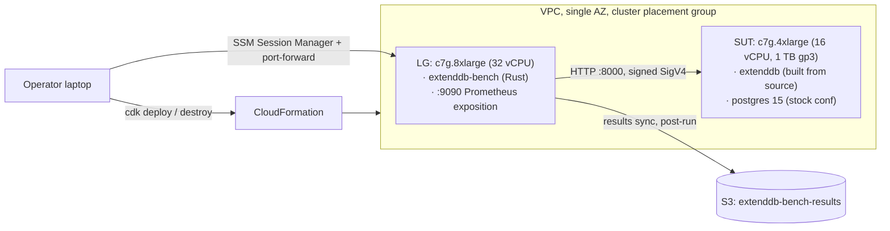
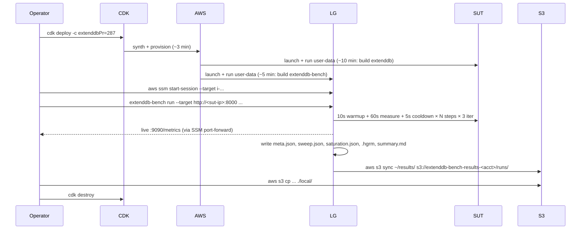

# Perf Testing POC v0.1 — Design

> [!abstract] One-line summary
> A 2-instance EC2 framework that measures ExtendDB's PutItem saturation throughput end-to-end, automated with CDK, built from source (no Docker), using a Rust open-loop load generator. Reproducible to ±5% across iterations. Implementable in one focused session.

This is the v0.1 design. It derives directly from [[Research/Perf Testing in Analog Projects]] and the design grilling in `#KiRoom/40081431/research/6`. It is intentionally narrow in scope so the *plumbing* (CDK, EC2 provisioning, source-build flow, Rust load gen, results collection) is what gets validated end-to-end. Workload diversity, comparison oracles, regression gates, and Postgres tuning are explicit v0.2+.

## Objective

> Operator runs `cdk deploy` (≤10 min wait for first build), runs `extenddb-bench run --workload putitem-1kb --rps-sweep 1000,5000,25000,100000,250000`, gets back a JSON file containing per-step throughput + p50/p90/p99/p99.9 latency histograms + a saturation cliff, then runs `cdk destroy`. **Reproducible to within ±5% relative stddev on three back-to-back runs against the same ExtendDB SHA.**

That single sentence is the v0.1 acceptance test.

## Scope

### In scope

- 2 EC2 instances (LG + SUT) provisioned via CDK with `asomasun-admin` AWS profile in `us-east-1`.
- ExtendDB built from source on the SUT via cloud-init user-data; no Docker.
- Co-located PostgreSQL 15 on the SUT (ExtendDB's only supported backend).
- Single workload: `putitem-1kb` (PutItem, 1 KB items, uniform random over 1M keyspace, no pre-seed).
- SigV4-signed requests (the realistic client path).
- CSV-configurable RPS sweep, default geometric `1k → 5k → 25k → 100k → 250k`.
- 3 iterations per RPS step, memtier-style best/worst/aggregated reporting.
- HDR latency histograms, JSON sweep summary, Markdown human-readable report.
- Live Prometheus exposition on the LG during runs (`:9090/metrics`).
- ExtendDB version pinning by `branch+commit` *or* `pr-id` at deploy time.

### Out of scope (deferred to v0.2+)

- ❌ Multiple workloads (Put+Update, Put+Get, mixed, Query/Scan, batch ops, transactions).
- ❌ Comparison oracles (DDB-Local, real DDB, prior ExtendDB tags side-by-side).
- ❌ Postgres tuning (`shared_buffers`, `max_wal_size`, etc. — Postgres ships with stock defaults).
- ❌ Split Postgres-on-third-instance topology.
- ❌ Public dashboard / GH Pages history.
- ❌ Regression gate (no thresholds, just absolute numbers).
- ❌ Custom AMI bake (every deploy rebuilds from source via user-data).
- ❌ Spot instances.
- ❌ Multi-AZ / multi-region.
- ❌ Flamegraph capture during runs.
- ❌ boto3 pre-flight smoke check.

> [!note] On what we are actually measuring
> With Postgres co-located on the SUT, v0.1's saturation throughput is the **full deployed pipeline**: SigV4 → ExtendDB engine → Postgres → EBS gp3. The bottleneck is most likely Postgres WAL fsyncs or gp3 IOPS rather than ExtendDB's Rust async engine. This is honest and useful as a baseline number for the deployed-as-intended single-box config. Component-level isolation is v0.2 (split Postgres + flamegraphs).

## Locked decisions

| # | Decision | Choice | Why |
|---|---|---|---|
| Q1 | Scope | Saturation throughput, single config (no comparison) | Minimal plumbing surface; B and C inherit A |
| Q2 | Workload | PutItem-only, signed (SigV4), 1 KB items, uniform random over 1M keyspace, no pre-seed | Direct analog of Dragonfly's `--ratio 1:0`; no pre-seed phase |
| Q3 | SUT instance | `c7g.4xlarge` (16 vCPU, 32 GiB, up to 15 Gbps) | 16 cores stress async scheduler; cheaper than `c7gn`; same family as Dragonfly's published runs |
| Q3 | LG instance | `c7g.8xlarge` (32 vCPU, 64 GiB, up to 15 Gbps) | 2:1 vCPU asymmetry; SigV4 signing CPU-heavy; LG must not be the bottleneck |
| Q3 | Storage (SUT) | EBS gp3 1 TB, 16000 IOPS, 1000 MB/s | Headroom for Postgres data + WAL + bloat across runs without VACUUM FULL |
| Q3 | Storage (LG) | EBS gp3 30 GB root only | LG is stateless |
| Q3 | Topology | Same VPC + subnet + AZ + cluster placement group, private IPs only, SSM Session Manager for operator access | Lowest network latency; no SSH key management; matches Dragonfly's published methodology |
| Q3 | OS | Amazon Linux 2023 ARM64 | Latest kernel (6.1+), systemd, rustup-friendly |
| Q4 | Build approach | Cloud-init user-data, `git clone` + `cargo build --release` per deploy | Simplest plumbing; v0.2 can swap to AMI bake |
| Q4 | Version pinning | `branch+commit` *or* `pr-id` resolved to SHA at deploy time, written to `/etc/extenddb-version` and embedded in every result file | No floating refs; full reproducibility |
| Q4 | Bench harness repo | Separate repo at `~/projects/extenddb-bench`; not yet upstream | User's preference; iterate before PR |
| Q5 | Concurrency | Tokio async, single Rust binary | Standard; AWS SDK Rust is tokio-native |
| Q5 | HTTP + SigV4 | AWS SDK Rust (`aws-sdk-dynamodb`) with retries **disabled** | Free SigV4 + endpoint override; identical wire format to boto3 |
| Q5 | Loop model | Open-loop with `governor` rate limiting | Fixes coordinated omission; required to measure tail latency under saturation |
| Q5 | Histograms | `hdrhistogram` crate, output as `.hgrm` + JSON | Industry-standard for tail-latency benchmarks |
| Q5 | Run phases | 10 s warmup (discarded) + 60 s measure + 5 s cooldown | Avoids cold-cache + connection-establishment artifacts |
| Q5 | RPS sweep | CSV-configurable; default geometric `1000,5000,25000,100000,250000` | 5 steps × 5× per step finds cliff coarsely; exposes order-of-magnitude differences |
| Q5 | Saturation rule | Stop sweep when EITHER p99 > 100 ms OR error rate > 1% | Two cheap fail-fast signals |
| Q5 | Connections | 64 concurrent (LG side) | Plenty for ExtendDB's default sqlx pool; not gated |
| Q5 | Iterations | 3 per RPS step | memtier `-x` pattern; relative stddev < 5% acceptance gate |
| Q5 | Live metrics | Prometheus exposition on LG `:9090/metrics` | Watch p99 drift in real time via SSM port-forward |
| Q5 | Pre-flight | None (no boto3 conformance check) | Conformance is the existing harness's job, not the bench's |

## Architecture



### Components

#### 1. CDK stack (`infra/`)

**Language: TypeScript** (most CDK examples + best Cloudscape parity).

Two stacks:
- **`NetworkStack`**: VPC, single private subnet, NAT gateway (LG egress for git clone + cargo deps; SUT has no egress), security groups, S3 results bucket, SSM endpoints (so SUT can phone home for SSM agent without public egress).
- **`ComputeStack`**: cluster placement group, IAM instance role (SSM + S3 results write), the two EC2 instances with their user-data scripts, EBS volumes.

Stack parameters (CDK context):
```bash
# Required: one of these must be set
cdk deploy -c extenddbBranch=main -c extenddbCommit=a1b2c3d4...
cdk deploy -c extenddbPr=287
```

PR-id mode resolves to a 40-char SHA at synth time (via `gh api repos/ExtendDB/extenddb/pulls/<id>` from the operator's laptop), so synth → deploy → run is fully deterministic.

Tags applied to all resources:
```yaml
project: extenddb-bench
owner: asomasun
poc-version: "0.1"
extenddb-sha: <resolved-40-char-sha>
```

#### 2. SUT user-data (`infra/lib/user-data/sut.sh`)

```bash
#!/bin/bash
set -euxo pipefail

EXTENDDB_REF="$(cat /var/lib/cloud/instance/extenddb-ref)"   # branch:commit or sha

# 1. PostgreSQL 15 from PGDG
amazon-linux-extras enable postgresql15 || dnf install -y postgresql15-server postgresql15-contrib
PGDATA=/var/lib/pgsql/data
sudo -u postgres /usr/pgsql-15/bin/initdb -D "$PGDATA"
systemctl enable --now postgresql-15

# Stock conf — no tuning in v0.1.
sudo -u postgres psql -c "CREATE USER extenddb WITH PASSWORD 'extenddb-bench';"
sudo -u postgres psql -c "CREATE DATABASE extenddb OWNER extenddb;"

# 2. Rust toolchain
curl --proto '=https' --tlsv1.2 -sSf https://sh.rustup.rs | sh -s -- -y --default-toolchain stable
. "$HOME/.cargo/env"

# 3. Build ExtendDB from source
git clone https://github.com/ExtendDB/extenddb /opt/extenddb
cd /opt/extenddb
git checkout "$EXTENDDB_REF"
git rev-parse HEAD > /etc/extenddb-version
cargo build --release --bin extenddb

# 4. systemd unit + start
install -m 644 /opt/extenddb/contrib/extenddb.service /etc/systemd/system/
systemctl enable --now extenddb
```

> [!warning] EBS volume layout
> `/var/lib/pgsql` and `/opt/extenddb` both live on the 1 TB gp3 data volume mounted at `/var/lib`. Root volume stays small (30 GB). User-data must format and mount the data volume **before** initdb runs. CDK provisions the gp3 volume; user-data formats it as ext4 and adds an `/etc/fstab` entry.

#### 3. LG user-data (`infra/lib/user-data/lg.sh`)

```bash
#!/bin/bash
set -euxo pipefail

# 1. Rust toolchain
curl --proto '=https' --tlsv1.2 -sSf https://sh.rustup.rs | sh -s -- -y --default-toolchain stable
. "$HOME/.cargo/env"

# 2. Clone bench harness + build the load gen
git clone https://github.com/yesyayen/extenddb-bench /opt/extenddb-bench
cd /opt/extenddb-bench
cargo build --release --bin extenddb-bench

# 3. Symlink for convenience
ln -s /opt/extenddb-bench/target/release/extenddb-bench /usr/local/bin/extenddb-bench

# Note: bench is invoked manually via SSM run-command, no systemd unit.
```

#### 4. Load generator — `extenddb-bench` (Rust binary)

Single Rust crate at `loadgen/`. Single binary with `clap` subcommands. tokio multi-threaded runtime.

##### CLI shape

```text
extenddb-bench <SUBCOMMAND>

SUBCOMMANDS:
  run         Execute a benchmark sweep
  report      Re-render summary.md from an existing results dir
  version     Print the bench tool's git SHA + ExtendDB SDK version

RUN OPTIONS:
  --target <URL>              ExtendDB endpoint (e.g. http://10.0.1.42:8000)
  --workload <NAME>           putitem-1kb (only choice in v0.1)
  --rps-sweep <CSV>           e.g. 1000,5000,25000,100000,250000  [conflicts with --rps-sweep-file]
  --rps-sweep-file <PATH>     read CSV sweep from file
  --duration <DURATION>       per-step measure window  [default: 60s]
  --warmup <DURATION>         discarded warmup before measure  [default: 10s]
  --cooldown <DURATION>       quiet window between steps  [default: 5s]
  --iterations <N>            iterations per RPS step  [default: 3]
  --connections <N>           concurrent in-flight connections  [default: 64]
  --keyspace <N>              uniform-random key cardinality  [default: 1000000]
  --item-size-bytes <N>       item payload size  [default: 1024]
  --output <DIR>              results directory  [default: ./results/<timestamp>]
  --aws-region <REGION>       SigV4 region  [default: us-east-1]
  --metrics-port <PORT>       Prometheus exposition port  [default: 9090]
```

##### Internals

| Concern | Choice | Crate |
|---|---|---|
| HTTP + SigV4 | AWS SDK Rust with `RetryConfig::disabled()` and custom endpoint URL | `aws-sdk-dynamodb`, `aws-config` |
| Open-loop rate limit | Per-step token bucket; if scheduled-time ≤ now, dispatch + record both *intended* and *actual* send timestamps | `governor` |
| Histograms | One per RPS step per iteration; serialize as `.hgrm` (text) and JSON percentiles snapshot | `hdrhistogram` |
| Live metrics | Prometheus text exposition + axum `:9090` server | `metrics`, `metrics-exporter-prometheus`, `axum` |
| CLI parsing | derive macros, subcommands, value parsing | `clap` v4 |
| Async runtime | multi-threaded with `--all-features` | `tokio` |
| Output formats | JSON via `serde_json`; markdown via `tinytemplate` | `serde`, `tinytemplate` |
| Random key gen | `WyRand` PRNG seeded per worker for reproducibility | `wyrand` or `fastrand` |

##### Operational metrics published on `:9090/metrics`

```text
loadgen_target_rps                       # what we asked for
loadgen_achieved_rps                     # what we got
loadgen_inflight_requests                # current concurrency
loadgen_request_duration_seconds_bucket  # histogram, by op + status
loadgen_errors_total                     # counter, by error class
loadgen_lg_cpu_user_pct                  # safety belt: LG saturation flag
loadgen_lg_mem_rss_bytes
loadgen_step_index                       # which RPS step we're on
loadgen_iteration_index                  # which iteration of that step
process_*                                # standard process metrics
```

> [!warning] LG saturation safety belt
> Any RPS step where `loadgen_lg_cpu_user_pct ≥ 90%` for ≥ 50% of the measure window is **flagged as LG-bottlenecked** in `summary.md`. The cliff at that step is invalid (we didn't push the SUT, we pushed the LG). The implementer must add this check.

#### 5. Workload — `putitem-1kb`

```rust
// loadgen/src/workload/putitem.rs
//
// PutItem with a 1 KB item (PK only), keys drawn uniform-random over [0, keyspace).

pub struct PutItem1Kb {
    keyspace: u64,          // 1_000_000
    payload_size: usize,    // 1024 bytes
    table_name: String,     // "bench"
}

impl Workload for PutItem1Kb {
    async fn execute(&self, client: &DdbClient, rng: &mut impl Rng) -> Result<Duration> {
        let key = rng.gen_range(0..self.keyspace);
        let val = generate_payload(self.payload_size);    // deterministic from key for cacheability
        let started = Instant::now();
        client.put_item()
            .table_name(&self.table_name)
            .item("pk", AttributeValue::S(format!("{key:012}")))
            .item("val", AttributeValue::S(val))
            .send().await?;
        Ok(started.elapsed())
    }
}
```

Table created once during deploy via SSM run-command (or the bench's `init` subcommand, but for v0.1 a one-line shell from CDK is enough): single hash key `pk` (S), no sort key, on-demand billing-mode-equivalent (ExtendDB doesn't enforce capacity).

## Output schema

Per run, the LG writes to `~/results/<timestamp>/`:

```text
results/20260526T040800/
├── meta.json
├── sweep.json
├── saturation.json
├── step-001000-iter-1.hgrm
├── step-001000-iter-2.hgrm
├── step-001000-iter-3.hgrm
├── step-005000-iter-1.hgrm
├── ...                          (15 files for the default 5-step × 3-iter sweep)
└── summary.md
```

Then `aws s3 sync` to `s3://extenddb-bench-results-<account>/runs/<timestamp>/` as the run's last step (configured in CDK via S3 bucket + IAM role on the LG instance profile).

### `meta.json`

```json
{
  "schema_version": 1,
  "run_id": "20260526T040800",
  "started_at": "2026-05-26T04:08:00Z",
  "ended_at": "2026-05-26T04:23:42Z",
  "extenddb_sha": "a1b2c3d4...",
  "extenddb_pr": 287,
  "bench_sha": "e5f6...",
  "sut_instance_type": "c7g.4xlarge",
  "lg_instance_type": "c7g.8xlarge",
  "az": "us-east-1a",
  "placement_group": "extenddb-bench-pg",
  "sut_kernel": "6.1.x-amzn",
  "lg_kernel": "6.1.x-amzn",
  "postgres_version": "15.x",
  "ami_id": "ami-...",
  "workload": "putitem-1kb",
  "rps_sweep": [1000, 5000, 25000, 100000, 250000],
  "duration_secs": 60,
  "warmup_secs": 10,
  "cooldown_secs": 5,
  "iterations": 3,
  "connections": 64,
  "keyspace": 1000000,
  "item_size_bytes": 1024
}
```

### `sweep.json`

Array of per-step-per-iteration records:

```json
[
  {
    "step_target_rps": 1000,
    "iteration": 1,
    "achieved_rps": 998.4,
    "errors_total": 0,
    "error_rate": 0.0,
    "p50_us": 412,
    "p90_us": 580,
    "p99_us": 920,
    "p999_us": 1840,
    "lg_cpu_p99_pct": 12.4,
    "lg_bottlenecked": false
  },
  ...
]
```

### `saturation.json`

```json
{
  "max_sustained_rps": 100000,
  "p99_at_max_us": 8400,
  "cliff_step_rps": 250000,
  "cliff_reason": "p99_exceeded_100ms",
  "p99_at_cliff_us": 142000,
  "error_rate_at_cliff": 0.003,
  "relative_stddev_at_max_pct": 3.2
}
```

### `summary.md`

Human-readable report with:
- Run metadata table.
- Sweep table: target RPS · achieved RPS · p50/p90/p99/p99.9 · errors · LG CPU · bottleneck flag, one row per (step × iteration), with aggregated mean/min/max under each step group.
- Saturation cliff callout.
- Variance summary: relative stddev across iterations per step.
- Warnings for LG-bottlenecked steps.

## Run lifecycle



> [!tip] Operator workflow per run
> 1. `cd ~/projects/extenddb-bench/infra && cdk deploy -c extenddbPr=287` — wait for COMPLETE (~10–15 min for first deploy on a SHA, ~3 min if SHA was already in any prior deploy and SUT was instance-replaced)
> 2. Get SUT private IP from CDK outputs.
> 3. `aws ssm start-session --target <lg-instance-id>` (or use the `scripts/run-via-ssm.sh` wrapper)
> 4. `extenddb-bench run --target http://<sut-ip>:8000`
> 5. Wait ~16 min (3 iter × 5 steps × 75 s each + cooldowns + setup).
> 6. Pull results: `aws s3 sync s3://extenddb-bench-results-<acct>/runs/<ts>/ ./results/<ts>/`
> 7. `cdk destroy`.

## Repository structure

Separate repo at `~/projects/extenddb-bench/` (per Q4 decision; not yet upstreamed).

```text
extenddb-bench/
├── README.md                          # quick start + cost estimate + decision log
├── infra/                             # CDK TypeScript
│   ├── package.json
│   ├── tsconfig.json
│   ├── cdk.json
│   ├── bin/
│   │   └── stack.ts
│   └── lib/
│       ├── network-stack.ts
│       ├── compute-stack.ts
│       ├── pr-resolver.ts             # gh api → SHA at synth time
│       └── user-data/
│           ├── sut.sh
│           └── lg.sh
├── loadgen/                           # Rust crate
│   ├── Cargo.toml
│   ├── Cargo.lock
│   ├── src/
│   │   ├── main.rs
│   │   ├── cli.rs                     # clap definitions
│   │   ├── workload/
│   │   │   ├── mod.rs                 # Workload trait
│   │   │   └── putitem.rs
│   │   ├── runner.rs                  # open-loop loop + governor + iterations
│   │   ├── histogram.rs               # hdrhistogram wrappers
│   │   ├── metrics.rs                 # prometheus exposition
│   │   ├── output.rs                  # meta/sweep/saturation/summary writers
│   │   └── lg_health.rs               # CPU/mem self-monitoring + bottleneck flag
│   ├── sweeps/
│   │   ├── default.csv                # 1000,5000,25000,100000,250000
│   │   ├── low-end.csv                # 100,500,1000,2000,3000
│   │   └── cliff-finder.csv           # narrower steps near a known cliff
│   └── tests/
│       └── unit/                      # workload payload generation, histogram math
├── docs/
│   └── design-v0.1.md                 # copy of this vault note for repo reproducibility
└── scripts/
    ├── run-via-ssm.sh                 # convenience wrapper around aws ssm start-session
    └── pull-results.sh                # aws s3 sync + open summary.md
```

## Cost estimate (us-east-1, on-demand)

| Resource | Hourly | Notes |
|---|---|---|
| `c7g.8xlarge` (LG) | $1.16 | 32 vCPU |
| `c7g.4xlarge` (SUT) | $0.58 | 16 vCPU |
| EBS gp3 1 TB / 16000 IOPS / 1000 MB/s | ~$0.25 | $0.11 storage + $0.089 IOPS + $0.048 throughput |
| NAT gateway | $0.045 + $0.045/GB | minimal traffic |
| S3 (results) | <$0.01 | results are MB-scale |
| **Combined** | **~$2.05/hr** | |

A full `deploy → run → destroy` cycle (~30 min) costs **~$1**. Three back-to-back full sweeps fit in **~$5**. Five iterations of v0.1 development (with destroy-between) over a month cap at **~$30**.

> [!info] Cost discipline
> Stack must support `cdk destroy` cleanly (no orphaned ENIs, no stuck volumes). Implementer adds `--auto-teardown-after <duration>` as a v0.2 polish; v0.1 relies on manual destroy.

## v0.1 acceptance criteria

The POC is "done" when:

1. ✅ A fresh operator with the repo + AWS profile + Node + Rust runs `cdk deploy` and gets a healthy stack within 15 min on first deploy.
2. ✅ `extenddb-bench run --target <sut> --rps-sweep 1000,5000,25000,100000,250000` completes in under 20 min and writes the full `results/<ts>/` directory.
3. ✅ `summary.md` shows monotone-non-decreasing throughput up to a cliff and a clear cliff step where p99 > 100 ms or error rate > 1%.
4. ✅ Three back-to-back runs against the same `extenddb-sha` produce `max_sustained_rps` values whose relative standard deviation is **< 5%**.
5. ✅ Live `:9090/metrics` on the LG is scrape-able via SSM port-forward during a run.
6. ✅ `cdk destroy` removes 100% of provisioned resources.

If criterion 4 fails (variance > 5%), the implementer's first investigation is the LG saturation safety belt — most v0.1 variance comes from LG itself drifting under load.

## Anti-patterns to avoid (drawn from analog research)

These came out of [[Research/Perf Testing in Analog Projects]] and apply here directly:

> [!failure] Don't let v0.1 become any of these
> - **Closed-loop load gen** — coordinated omission gives you garbage tail latency. Open-loop is non-negotiable.
> - **AWS SDK retries enabled** — turns 1 transient error into 4 inflated requests. Disable.
> - **Floating ExtendDB ref** — pinning to a SHA is non-negotiable; "main" today is not "main" tomorrow.
> - **LG and SUT same vCPU count** — Dragonfly uses 64/48 (LG/SUT); we use 32/16. Asymmetry mandatory.
> - **Tuning Postgres "to make numbers look better"** — v0.1 commits to stock Postgres. Tuning is a v0.2 ADR.
> - **Coalescing runs across SHAs** — every result file embeds the SHA; never compare across SHAs without the comparison oracle (v0.2).
> - **Skipping the LG bottleneck check** — without it you publish "ExtendDB does X RPS" when X is actually the LG's ceiling.

## Out of scope — v0.2+ roadmap (informational, not in this POC)

| Item | Stage | Why later |
|---|---|---|
| GetItem workload + pre-seed phase | v0.2 | Adds deterministic pre-seed orchestration; once done, mixed workloads are cheap |
| UpdateItem workload | v0.2 | Different code path than PutItem (read-modify-write) |
| Postgres tuning profile | v0.2 | Pinned `shared_buffers`, `max_wal_size`, etc.; needs its own validation runs |
| Split Postgres on third instance | v0.2 | Isolates ExtendDB-engine throughput from Postgres throughput |
| Comparison oracle (DDB-Local + real DDB) | v0.3 | The named-database matrix from FerretDB-dance |
| Custom AMI bake (Packer) | v0.3 | After daily-run cadence makes 10-min build expensive |
| Public results dashboard (GH Pages) | v0.3 | Unique among analogs; ship once we trust the numbers |
| Flamegraph capture during runs | v0.3 | `--serverprof=cpu` analog; closes the auth-hotspot investigation loop |
| Regression gate (hard threshold per workload) | v0.4+ | Only after self-hosted runner; Redpanda's `assert dedicated_nodes` pattern |
| LLM-seeded fuzz on PR | adjacent | Dragonfly's `fuzz-pr.yml` retargeted to DynamoDB JSON; separate ADR |

## References

External:
- [Dragonfly benchmark methodology](https://www.dragonflydb.io/docs/getting-started/benchmark)
- [memtier_benchmark blog post](https://redis.io/blog/memtier_benchmark-a-high-throughput-benchmarking-tool-for-redis-memcached/)
- [HDR Histogram](http://hdrhistogram.org/)
- [Gil Tene on Coordinated Omission](https://www.youtube.com/watch?v=lJ8ydIuPFeU)
- [AWS SDK for Rust (`aws-sdk-dynamodb`)](https://docs.rs/aws-sdk-dynamodb/)
- [`hdrhistogram` Rust crate](https://docs.rs/hdrhistogram/)
- [`governor` Rust crate](https://docs.rs/governor/)

Internal:
- Source design grilling: `#KiRoom/40081431/research/6`
- Sister analog research: [[Research/Perf Testing in Analog Projects]]
- Strategy: [[Strategy/Evolution Playbook]], [[Strategy/Entry Points]]

## Implementer notes (read this first)

> [!todo] For the session that picks this up
> 1. **Read this entire doc top to bottom before writing any code.** Every decision is locked.
> 2. **Bootstrap order:** create the repo skeleton → CDK stack scaffold → `loadgen/` crate scaffold → user-data scripts → end-to-end deploy test (no actual benchmarking) → fill in workload + runner → first real run.
> 3. **First milestone:** `cdk deploy` produces a healthy stack with both instances `running` and ExtendDB responding to `curl :8000/health` (or whatever ExtendDB exposes; verify in repo). Don't write the load gen until this works.
> 4. **Second milestone:** `extenddb-bench run` with a single 1k-RPS step for 5s — produces a single `.hgrm` and a non-empty `sweep.json`. Don't run the full sweep until this works.
> 5. **Third milestone:** full default sweep, then verify `summary.md` is readable.
> 6. **Acceptance:** three back-to-back runs against the same SHA, relative stddev < 5%.
> 7. **Don't add features.** If you find yourself wanting to add a workload, a tuning knob, a comparison mode, a regression gate, a flamegraph, or a CloudWatch dashboard, **stop**. Write it as a v0.2 line item in this doc and keep going. v0.1 ships scope-locked or it doesn't ship.
> 8. **AWS profile:** `asomasun-admin` for all CDK + bench operations.
> 9. **Region:** `us-east-1`.
> 10. **GitHub username for repo creation:** `yesyayen`. Bench harness repo path: `https://github.com/yesyayen/extenddb-bench` (private OK for now).
