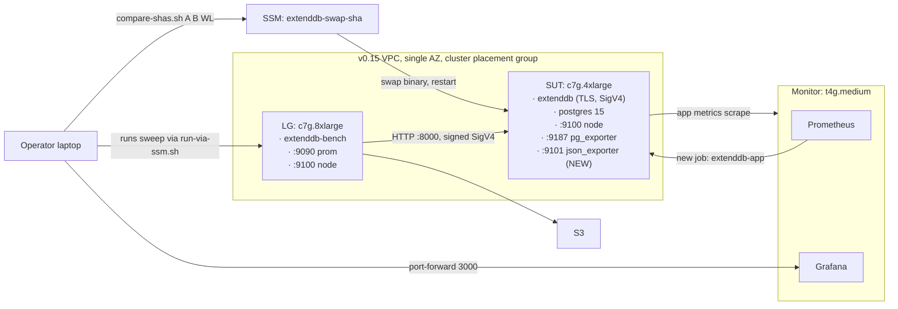

# Perf Testing POC v0.3 - Design

> [!abstract] One-line summary
> v0.3 turns the harness from "what is the number" into "did this PR move the number, and where in the stack." It adds three workloads (`getitem-1kb`, `updateitem-1kb`, `mixed-rw`) on top of an idempotent pre-seed phase, a `compare` subcommand for head-to-head SHA runs with bootstrap CIs, and an ExtendDB-app Prometheus surface so dashboards finally see the engine itself.

This doc only covers the v0.3 delta. Anything not contradicted here inherits from [`design-v0.1.md`](design-v0.1.md): the CDK layout, instance shapes, AZ + placement-group + private-subnet topology, AL2023 ARM64 OS, source-build approach, SigV4 + retries-disabled SDK config, open-loop pacing, HDR histograms, S3 results sync, and the operator workflow. v0.15 added the Monitor stack with Prometheus + Grafana; v0.3 builds on that.

## Objective

Two new operator workflows, one new dashboard surface:

1. **Workload-diversity sweep**: `extenddb-bench run --workload getitem-1kb --rps-sweep-file ...` runs an idempotent pre-seed (if needed), then a sweep against reads with 100% hit rate. Same shape for `updateitem-1kb` and `mixed-rw`.
2. **Comparison run**: `scripts/compare-shas.sh BASELINE_SHA CANDIDATE_SHA WORKLOAD` produces a single `compare-summary.md` with per-step verdicts (`improvement` / `regression` / `within_noise`) backed by bootstrap 95% CIs.
3. **ExtendDB-app dashboard**: per-API request rate, availability, p50/p99 latency, error breakdown, sqlx pool depth, storage query rate. Visible in Grafana during every run.

Single acceptance gate that pins the implementation honest: `compare-shas.sh A A putitem-1kb` must produce `within_noise` on every step. If a SHA does not match itself, the stat test is wrong.

## Scope

### In scope

- New workloads: `getitem-1kb`, `updateitem-1kb`, `mixed-rw` (configurable read:write ratio).
- Pre-seed phase: idempotent, parallel PutItem fill of the keyspace, gated by an S3 stamp file.
- `extenddb-bench compare` data path (orchestrated from operator laptop via `scripts/compare-shas.sh`).
- Same-SUT sequential SHA swap via SSM (no second SUT, no instance replacement between legs).
- Drop-and-recreate the bench table between legs.
- Bootstrap 95% CIs (1000 resamples) on `achieved_rps` and `p99_us`; verdict labels.
- ExtendDB JSON `/metrics` to Prometheus shim (`prometheus-json-exporter` on the SUT, port `:9101`).
- New Grafana dashboards: `extenddb-app` (dataplane / control plane split) and `hosts-detailed` (grafana.com `1860`, variable-driven for LG vs SUT).
- New output file: `compare-summary.json` (schema_version 2). Single-leg `sweep.json` stays at v1.

### Out of scope (deferred)

- Component isolation (split Postgres on a third instance) - v0.4.
- `perf record` / flamegraph capture during the cliff step - v0.4.
- Postgres tuning profiles - v0.4.
- Multi-LG fan-out (single LG can saturate a c7g.4xlarge SUT today) - v0.4.
- Three-way comparisons or matrix runs - v0.4.
- Read-miss workloads (every read in v0.3 hits the pre-seeded keyspace) - v0.4.
- BatchGetItem / BatchWriteItem / TransactWriteItems / Query / Scan - v0.4+.
- Native Prometheus exporter inside ExtendDB itself (replaces the JSON shim) - upstream contribution, separate doc.
- Regression gate / hard threshold per workload - v0.5+.
- Custom AMI bake, GH Pages dashboard, multi-AZ - inherited as out-of-scope.

> [!note] Why same-SUT for compare
> A second SUT in the same placement group cuts wall time but doubles the spend per cycle and reintroduces instance variance even within a placement group. Sequential on one SUT eliminates instance variance entirely (the same vCPU + EBS volume + Postgres data files run both legs) at the cost of one extra `cargo build --release` (about 10 minutes). v0.3 trades wall time for variance.

## Locked decisions

| # | Decision | Choice | Why |
|---|---|---|---|
| Q1 | Pre-seed strategy | PutItem at `--connections 256`, deterministic key sweep `[0, keyspace)`, idempotent. | Reuses existing PutItem path. No batch API support needed. Deterministic key + payload means re-runs are no-ops (overwrite with the same bytes). |
| Q1 | Pre-seed gating | S3 stamp file at `s3://<bucket>/preseed/<sha>/<keyspace>-<item_size>.done`. Skips re-seed when present. | Cheap idempotency check; survives stack tear-down. Stamp encodes the SHA so a binary swap correctly invalidates. |
| Q1 | Pre-seed RPS | Hard cap at `--preseed-rps 50000`, configurable, default tuned for c7g.4xlarge SUT. | Keeps pre-seed under 5 minutes for 1 M items at 1 KB; well below the v0.1 cliff. |
| Q2 | Read-hit invariant | Reads draw keys uniform random from `[0, keyspace)` where every key is pre-seeded. 100% hit rate. | Misses are a separate dimension; bundling them muddles the signal. v0.4 adds a `--miss-ratio` knob. |
| Q2 | Mixed-rw ratio | `--rw-ratio R:W` as integer split summed to 100 (e.g. `80:20`). Reads hit the pre-seeded keyspace; writes overwrite within the same keyspace. | Single keyspace, single table, no second hash key. |
| Q3 | Compare topology | Same SUT, sequential. Binary swap via SSM run-command `extenddb-swap-sha <sha>`. Postgres process untouched between legs. | Eliminates instance variance. Postgres data dir survives the swap; the table reset (Q4) handles any cache concerns. |
| Q3 | SHA swap mechanism | SSM doc that runs: stop systemd unit, `git fetch && git checkout <sha>`, `cargo build --release`, write `/etc/extenddb-version`, start systemd unit, poll `/health`. | One SSM doc, idempotent, callable from the operator laptop. No CDK redeploy. |
| Q3 | Compare driver | `scripts/compare-shas.sh` on operator laptop. Calls SSM doc, then runs the sweep on LG, then repeats. Writes both legs into one results dir. | Avoids extra IAM. Easy to lift into CI later. |
| Q4 | Inter-leg state reset | Drop and recreate the `bench` table before each leg's sweep starts (after pre-seed). Postgres restart between legs is optional and not on by default. | Prevents warm-cache bleed. Pre-seed runs against the freshly created table. |
| Q5 | Stat test | Bootstrap 95% CI, 1000 resamples, percentile method. Per step, on `achieved_rps` and on `p99_us`. | Non-parametric; no normality assumption; standard for skewed latency distributions. |
| Q5 | Verdict labels | `improvement`, `regression`, `within_noise`. Decision rule below. | Three labels are enough; no thresholds beyond the CI. |
| Q5 | Self-match guard | `compare-shas.sh A A` MUST produce `within_noise` on every step. Otherwise the stat test is buggy. | Same idea as v0.1's `rel_stddev < 5%` gate, lifted to the meta level. |
| M1 | ExtendDB metrics surface | `prometheus-json-exporter` systemd unit on the SUT at `:9101`, scraping `https://127.0.0.1:8000/metrics` with a YAML mapping that translates the JSON shape into Prometheus series. | No ExtendDB code change in v0.3. Native exporter is a v0.4+ upstream contribution. |
| M1 | Scrape target wiring | New SSM Parameter Store entry `/extenddb-bench/sut-app-metrics-ip`. Monitor's `refresh-targets.timer` adds an `extenddb-app` job to `targets/extenddb-app.json`. | Reuses v0.15's file-SD pattern. |
| M1 | New dashboards | `extenddb-app` (dataplane and control plane sections); `hosts-detailed` (grafana.com `1860`, variable for LG vs SUT). Existing `bench` / `hosts` / `storage` keep their UIDs. | Keeps the v0.15 contract intact for muscle memory. |

### Verdict decision rule

For each step, given baseline median X_b and candidate median X_c with bootstrap 95% CIs:

- **`regression` on `p99_us`**: X_c CI lower bound > X_b CI upper bound.
- **`improvement` on `p99_us`**: X_c CI upper bound < X_b CI lower bound.
- **`within_noise` on `p99_us`**: CIs overlap.
- Same shape for `achieved_rps`, with the inequality flipped (higher is better).

A step's verdict is the worse of the two metrics' verdicts (`regression` > `within_noise` > `improvement`). The summary's headline verdict is the worst step's verdict.

## Architecture delta



Boxes that change:

- **SUT**: gains a `prometheus-json-exporter` systemd unit on `:9101`, plus a YAML mapping file at `/etc/extenddb-bench/extenddb-json-exporter.yml`. User-data writes the unit and the mapping; cloud-init enables it after ExtendDB is healthy.
- **Monitor**: `targets/extenddb-app.json` joins the file-SD set; the existing `refresh-targets.timer` populates it from a new SSM param. Prometheus scrape config gains a `extenddb-app` job. Grafana provisioning gains two new dashboards.
- **Operator workflow**: a new script. No CDK change to invoke it.

Nothing else moves. CDK stack list, IAM roles, security groups, EBS topology, DNS, the existing `bench` / `hosts` / `storage` dashboards: all unchanged.

## Implementation milestones

In order. Each milestone has a smoke test the implementer must pass before moving on.

### Milestone 0: ExtendDB metrics in Grafana

This lands first because every later milestone benefits from a populated dashboard during smoke tests.

1. Add `prometheus-json-exporter` install to `infra/lib/user-data/sut.sh`. Pin to a release version (binary tarball is enough; no source build).
2. Write `/etc/extenddb-bench/extenddb-json-exporter.yml`. Mapping is documented below in Section "ExtendDB JSON to Prometheus mapping".
3. systemd unit `extenddb-json-exporter.service`. Scrapes `https://127.0.0.1:8000/metrics` with `--insecure` (loopback only). Listens on `:9101`. Restarts on failure with a 30 s back-off.
4. Publish SUT app-metrics IP to SSM: `aws ssm put-parameter --name /extenddb-bench/sut-app-metrics-ip --value $(hostname -I | awk '{print $1}'):9101 --overwrite`.
5. Monitor's `refresh-targets.sh` learns about a fourth target file `extenddb-app.json` populated from the new SSM key.
6. Prometheus config (`/etc/prometheus/prometheus.yml`) gets a fourth `file_sd_configs` job named `extenddb-app`.
7. Grafana provisioning ships two new dashboard JSONs:
   - `extenddb-app.json` (uid `bench-extenddb-app`) with the dataplane / control plane panels (see Section "Dashboards" below).
   - `hosts-detailed.json` (uid `bench-hosts-detailed`) imported from grafana.com `1860`, datasource UID set to the same `PBFA97CFB590B2093`, instance variable bound to `node{instance=~".*:9100"}`.

> [!success] M0 smoke test
> 1. Deploy a stack. SSM into the SUT.
> 2. `curl -k https://127.0.0.1:9101/metrics | head -50` shows series with names like `extenddb_request_count{operation="PutItem"}`.
> 3. Open Grafana. The `extenddb-app` dashboard's PutItem request-rate panel goes non-zero during a v0.1-style sweep.
> 4. The `hosts-detailed` dashboard renders for both LG and SUT via the variable selector.

### Milestone 1: pre-seed phase

1. New CLI subcommand `extenddb-bench preseed`. Flags: `--target`, `--table-name`, `--keyspace`, `--item-size-bytes`, `--connections` (default 256), `--preseed-rps` (default 50000), `--stamp-bucket`, `--stamp-prefix`, `--extenddb-sha`.
2. New module `loadgen/src/preseed.rs`. Iterates `[0, keyspace)` deterministically, splits across `connections` workers, uses the same payload generator as `putitem-1kb` (deterministic from key) so re-seed writes the same bytes.
3. Open-loop pacing reuses `runner.rs` rate-limit machinery (governor) with the `preseed-rps` cap. No HDR histograms, no per-step files. Single counter for items written, error count, elapsed time.
4. S3 stamp file: write `s3://<bucket>/preseed/<sha>/<keyspace>-<item_size>.done` with the seed metadata (started, ended, rate). Check before seeding; if present and metadata matches, return `Skipped(reason)` without firing a single PutItem.
5. `extenddb-bench run` learns a `--ensure-preseed` flag. When true, runs `preseed` (or skips via stamp) before the sweep. `getitem-1kb`, `updateitem-1kb`, and `mixed-rw` set this implicitly via `Workload::requires_preseed()`. `putitem-1kb` does not.

> [!success] M1 smoke test
> 1. Fresh stack. `extenddb-bench preseed --keyspace 100000` writes 100 000 items in under a minute.
> 2. Run again with the same flags. Logs `preseed: skipped (stamp present)`. No items written. Exit code 0.
> 3. Force re-seed via `--force`. Stamp is overwritten; items are rewritten with identical bytes (sqlx round-trip is a no-op at the data level).

### Milestone 2: read and update workloads

1. New file `loadgen/src/workload/getitem.rs` implementing `Workload` for `GetItem1Kb`.
   - `execute`: pick `key in [0, keyspace)` uniform random, call `client.get_item().table_name(...).key("pk", S(format!("{key:012}"))).send().await?`.
   - On `ItemNotFound` (returned as a successful response with empty `Item`), increment a `loadgen_read_miss_total` counter and treat as success at the latency level. v0.3 design assumes 100% hit so any miss flags a pre-seed bug; the dashboard panel for `loadgen_read_miss_total` should stay at 0.
   - `requires_preseed() -> true`.
2. New file `loadgen/src/workload/updateitem.rs` implementing `UpdateItem1Kb`.
   - `execute`: pick key, call `update_item` with `update_expression = "SET val = :v"`, `expression_attribute_values = {":v": S(payload(key, salt))}`. The salt is per-iteration so updates actually change bytes (otherwise sqlx UPDATE ... WHERE val = same-bytes might short-circuit; verify against ExtendDB engine behavior in the smoke test).
   - `requires_preseed() -> true`.
3. New file `loadgen/src/workload/mixed.rs` implementing `MixedRw`.
   - Holds an inner `GetItem1Kb` and an inner `UpdateItem1Kb` and an `r:w` ratio.
   - `execute`: draw a uniform random byte; if `byte % 100 < r`, dispatch read; else dispatch update.
   - Per-op latencies and counters are tagged `op=read` / `op=write` for the dashboard split.
4. Register all three in `workload::build`. Adding any new workload still equals "new file plus one match arm."
5. `runner.rs::run_step` learns a `Workload::tag(op_kind)` so HDR histograms split by `op_kind` for mixed workloads. JSON output gets `read_p99_us` and `write_p99_us` fields when the workload reports a split; otherwise just `p99_us` as today.
6. `loadgen/sweeps/` gains `read.csv` and `mixed.csv` (sane defaults for the read and mixed cliffs, narrower steps near the expected knee since reads cliff later).

> [!success] M2 smoke test
> 1. Sweep `getitem-1kb` at 1 k RPS for 30 s. `summary.md` shows zero error rate and `loadgen_read_miss_total` is exactly 0.
> 2. Sweep `updateitem-1kb` at 1 k RPS for 30 s. The bench table's `val` columns differ from their pre-seed bytes when sampled (proves updates actually mutate).
> 3. Sweep `mixed-rw --rw-ratio 80:20` at 5 k RPS for 30 s. `sweep.json` records `read_p99_us` and `write_p99_us` separately, and the `extenddb-app` dashboard shows the GetItem and UpdateItem panels both populated.

### Milestone 3: SHA swap doc

1. New SSM document `extenddb-bench-swap-sha` (registered by CDK in `compute-stack.ts`).
2. Document body: stop unit, `cd /opt/extenddb && git fetch --all && git checkout $SHA && cargo build --release --bin extenddb`, write `/etc/extenddb-version`, start unit, poll `https://127.0.0.1:8000/health` for up to 60 s, exit 0 if healthy.
3. Wrapper script `scripts/swap-sha.sh <sha>` calls `aws ssm send-command --document-name extenddb-bench-swap-sha --instance-ids <sut> --parameters sha=<sha>`, polls until `Success` or `Failed`, prints stdout/stderr.

> [!success] M3 smoke test
> 1. Deploy a stack on SHA `A`. `curl /etc/extenddb-version` returns `A`.
> 2. `scripts/swap-sha.sh B`. Wait for `Success`. `/etc/extenddb-version` returns `B`. `/health` is 200. Postgres is unaffected.
> 3. Run the v0.1 default sweep. Cliff matches B's known characteristics.

### Milestone 4: compare driver and stat test

1. New file `loadgen/src/compare.rs`. Pure Rust function that takes two `sweep.json` arrays (baseline, candidate) and emits the `compare-summary.json` schema below.
2. Bootstrap: 1000 resamples on the iteration values per step, percentile method for the 95% CI.
3. Verdict logic exactly as in "Verdict decision rule" above.
4. New CLI subcommand `extenddb-bench report-compare --baseline <dir> --candidate <dir> --output <dir>`. No new run logic; just data fusion.
5. New script `scripts/compare-shas.sh <baseline-sha> <candidate-sha> <workload> [--keyspace N] [--rps-sweep-file F]`. Orchestrates: swap to baseline, ensure-preseed, drop-and-recreate table, run sweep into `compare/<id>/baseline/`; swap to candidate, drop-and-recreate table, run sweep into `compare/<id>/candidate/`; call `report-compare`. Pre-seed stamp is keyed by SHA so the candidate leg re-seeds (this is correct: candidate must observe its own ExtendDB writing the seed bytes, not the baseline's).

> [!success] M4 smoke test
> 1. `compare-shas.sh A A putitem-1kb`. Self-compare. All steps verdict `within_noise`. Exits 0.
> 2. `compare-shas.sh A B putitem-1kb` where B is a known-faster SHA. At least one step verdict `improvement`. Headline verdict `improvement`.
> 3. Same with a known-slower B SHA. Headline `regression`. Exit code 1 so the script is CI-friendly.

### Milestone 5: dashboard polish

1. The `extenddb-app` dashboard gains a "compare overlay" annotation row driven by an annotation source on the Prometheus job. When a sweep starts, push an annotation marker tagged `leg=baseline` or `leg=candidate` so panels show vertical bars at the leg boundary. Implementation: `extenddb-bench run --leg-tag <s>` writes a Prometheus annotation via the Prometheus HTTP API (or Grafana annotation API; same effect).
2. Bench dashboard gains read/write split panels (latency, RPS) gated by a `workload` template variable.
3. README gains a "Comparing two SHAs" section.

> [!success] M5 smoke test
> 1. During `compare-shas.sh A B mixed-rw`, the `bench` and `extenddb-app` dashboards render two annotation lines, one at each leg boundary, with `leg=baseline` and `leg=candidate` labels.
> 2. The bench dashboard's read-latency panel only renders when `workload=mixed-rw` or `workload=getitem-1kb` is selected.

## ExtendDB JSON to Prometheus mapping

The shape of `GET /metrics` (verified against `crates/server/src/metrics_endpoint.rs` in the ExtendDB repo at the v0.3 implementation SHA): top-level JSON object with `snapshots` (array of `{ name, dimensions, value, unit }` for counters) and `histograms` (array of `{ name, dimensions, buckets, count, sum }` for latencies). Field names are the canonical `MetricName` enum values: `RequestCount`, `SuccessfulRequestLatency`, `SystemErrors`, `UserErrors`, `ThrottledRequests`, `PoolActiveConnections`, `PoolIdleConnections`, `PoolAcquireLatency`, `StorageQueryCount`, `StorageQueryLatency`, etc.

The implementer MUST verify the exact shape against the ExtendDB SHA used at deploy time before writing the YAML. ExtendDB's metrics shape is not part of any stability contract; it can change between SHAs.

`extenddb-json-exporter.yml` (sketch; flesh out against the live response):

```yaml
modules:
  default:
    metrics:
      - name: extenddb_request_count
        type: counter
        path: '{ .snapshots[?(@.name == "RequestCount")] }'
        labels:
          operation: '{.dimensions.Operation}'
        values:
          _: '{.value}'
      - name: extenddb_successful_request_latency_seconds
        type: histogram
        path: '{ .histograms[?(@.name == "SuccessfulRequestLatency")] }'
        labels:
          operation: '{.dimensions.Operation}'
        # buckets and count/sum extracted from the histogram object
      - name: extenddb_system_errors
        type: counter
        path: '{ .snapshots[?(@.name == "SystemErrors")] }'
        labels:
          operation: '{.dimensions.Operation}'
      - name: extenddb_user_errors
        type: counter
        path: '{ .snapshots[?(@.name == "UserErrors")] }'
        labels:
          operation: '{.dimensions.Operation}'
      - name: extenddb_throttled_requests
        type: counter
        path: '{ .snapshots[?(@.name == "ThrottledRequests")] }'
      - name: extenddb_pool_active_connections
        type: gauge
        path: '{ .snapshots[?(@.name == "PoolActiveConnections")] }'
      - name: extenddb_pool_idle_connections
        type: gauge
        path: '{ .snapshots[?(@.name == "PoolIdleConnections")] }'
      - name: extenddb_pool_acquire_latency_seconds
        type: histogram
        path: '{ .histograms[?(@.name == "PoolAcquireLatency")] }'
      - name: extenddb_storage_query_count
        type: counter
        path: '{ .snapshots[?(@.name == "StorageQueryCount")] }'
        labels:
          source: '{.dimensions.Source}'
          category: '{.dimensions.Category}'
      - name: extenddb_storage_query_latency_seconds
        type: histogram
        path: '{ .histograms[?(@.name == "StorageQueryLatency")] }'
        labels:
          source: '{.dimensions.Source}'
          category: '{.dimensions.Category}'
```

Latency units in ExtendDB are microseconds; the YAML mapping converts to seconds so the Prometheus naming convention holds. If the JSON exporter's histogram passthrough lacks unit conversion, do it in the dashboard PromQL with `* 1e-6`. Pick one place to do the conversion and document which.

## Dashboards

### `extenddb-app` (uid `bench-extenddb-app`)

**Dataplane section** (top of dashboard):

| Panel | PromQL |
|---|---|
| Request rate by API | `sum by (operation) (rate(extenddb_request_count[1m]))` |
| Availability by API | `1 - sum by (operation) (rate(extenddb_system_errors[1m])) / clamp_min(sum by (operation) (rate(extenddb_request_count[1m])), 1)` |
| p50 latency by API | `histogram_quantile(0.50, sum by (le, operation) (rate(extenddb_successful_request_latency_seconds_bucket[1m])))` |
| p99 latency by API | `histogram_quantile(0.99, sum by (le, operation) (rate(extenddb_successful_request_latency_seconds_bucket[1m])))` |
| Errors by API and class | stacked counts of `extenddb_system_errors` and `extenddb_user_errors` by `operation` |
| Throttled requests | `rate(extenddb_throttled_requests[1m])` |

**Control plane section** (below):

| Panel | PromQL |
|---|---|
| Overall p50 / p99 / p99.9 latency | `histogram_quantile(<q>, sum by (le) (rate(extenddb_successful_request_latency_seconds_bucket[1m])))` |
| Overall availability gauge | `1 - sum(rate(extenddb_system_errors[5m])) / clamp_min(sum(rate(extenddb_request_count[5m])), 1)` |
| sqlx pool active vs idle | `extenddb_pool_active_connections`, `extenddb_pool_idle_connections` |
| Pool acquire latency p99 | `histogram_quantile(0.99, sum by (le) (rate(extenddb_pool_acquire_latency_seconds_bucket[1m])))` |
| Storage query rate by source | `sum by (source) (rate(extenddb_storage_query_count[1m]))` |
| Storage query p99 by category | `histogram_quantile(0.99, sum by (le, category) (rate(extenddb_storage_query_latency_seconds_bucket[1m])))` |

### `hosts-detailed` (uid `bench-hosts-detailed`)

Imported from grafana.com `1860` (`node-exporter-full`). Datasource UID overridden to the same `PBFA97CFB590B2093`. Single template variable `instance` bound to `label_values(up{job="node"}, instance)`. Default value: SUT IP. Operator switches via the dropdown.

This dashboard is visually heavy and not the default for live runs. It exists for after-the-fact deep-dives into LG or SUT behavior at a specific moment.

## Output schema additions

### `compare-summary.json` (schema_version 2)

```json
{
  "schema_version": 2,
  "compare_id": "20260601T040800",
  "started_at": "2026-06-01T04:08:00Z",
  "ended_at": "2026-06-01T05:01:42Z",
  "workload": "mixed-rw",
  "rw_ratio": "80:20",
  "rps_sweep": [1000, 5000, 25000, 100000, 250000],
  "iterations_per_step": 3,
  "baseline": {
    "extenddb_sha": "a1b2c3d4...",
    "results_dir": "compare/20260601T040800/baseline"
  },
  "candidate": {
    "extenddb_sha": "e5f6a7b8...",
    "results_dir": "compare/20260601T040800/candidate"
  },
  "stat_test": {
    "method": "bootstrap_percentile",
    "resamples": 1000,
    "ci": 0.95
  },
  "steps": [
    {
      "step_target_rps": 1000,
      "achieved_rps": {
        "baseline_median": 999.8,
        "candidate_median": 1001.1,
        "baseline_ci_95": [998.7, 1000.3],
        "candidate_ci_95": [999.9, 1002.0],
        "verdict": "within_noise"
      },
      "p99_us": {
        "baseline_median": 4459,
        "candidate_median": 4380,
        "baseline_ci_95": [4441, 4477],
        "candidate_ci_95": [4361, 4404],
        "verdict": "improvement"
      },
      "step_verdict": "improvement"
    }
  ],
  "headline_verdict": "improvement"
}
```

### `compare-summary.md`

Human-readable rendering with:

- Header: baseline SHA, candidate SHA, workload, headline verdict.
- Per-step table: target RPS, baseline median (achieved RPS, p99), candidate median (achieved RPS, p99), each metric's verdict, step verdict.
- Tail section: cliff comparison (where each leg's cliff lands), iteration-level appendix per leg.
- Footer: stat test parameters and a note pointing to the per-leg `summary.md` for the underlying numbers.

### `meta.json` additions

Single-leg `meta.json` (schema_version stays at 1) gains optional fields used only when the run is a leg of a compare:

```json
{
  "compare_id": "20260601T040800",
  "leg": "baseline",
  "swap_started_at": "2026-06-01T04:08:00Z",
  "swap_ended_at": "2026-06-01T04:18:11Z"
}
```

## Anti-patterns (new for v0.3)

> [!failure] Don't let v0.3 become any of these
> - **Pre-seeding via the open-loop runner** instead of a dedicated phase. The runner's pacing logic is built for measurement, not for "fill this keyspace as fast as we can without falling over"; keep them separate and idempotent.
> - **Compare across SHAs without resetting the table** between legs. Postgres caches and sqlx pool state will favor whichever leg ran second.
> - **Compare across instances** ("baseline on SUT-A, candidate on SUT-B"). Even within a placement group there is enough variance to drown signal at low effect sizes.
> - **Tuning the bootstrap CI to look better.** If a step is `within_noise` at 95%, the answer is more iterations or smaller variance, not a 90% CI.
> - **Coalescing `sweep.json` and `compare-summary.json`** into one file. They have different consumers and different lifecycles. Keep them separate; let the compare doc reference the underlying sweep dirs.
> - **Letting the JSON exporter carry the histogram unit conversion silently.** Pick one place (the YAML or the PromQL), document it, and assert in a smoke test that an end-to-end p99 panel reports plausible microseconds.
> - **Bundling the histogram migration follow-up** (loadgen `summary` to `histogram` via `set_buckets_for_metric`) into v0.3. It is a separate, mechanical change with its own PR. Listed in v0.3 follow-ups; not in v0.3 acceptance.
> - **Adding a "fast" or "slow" comparison mode**. v0.3 is one comparison shape: same SUT, sequential, drop-and-recreate, bootstrap CI. Anything else is v0.4.

## Wall-time and cost

| Phase | Wall time | Notes |
|---|---|---|
| `cdk deploy` (delta over v0.15) | +1 min | json_exporter binary install + dashboard JSONs |
| Pre-seed (1 M items, 1 KB) | ~3 min | At 50 k RPS preseed cap; idempotent re-runs are sub-second |
| Single-leg sweep (default sweeps, 5 steps × 3 iter × ~75 s) | ~22 min | Same as v0.1 |
| SHA swap (cargo build + restart + health-poll) | ~10 min | Dominated by cargo |
| **Compare run total** | **~52 min** | Pre-seed + leg A sweep + swap + pre-seed (skipped or re-run) + leg B sweep + report |
| **Compare run cost (us-east-1, on-demand)** | **~$1.80** | At ~$2.05/hr per v0.1 cost table |

A v0.3 development month with 5 compare cycles caps at about $9 in compute, plus the always-on Monitor (t4g.medium, ~$25/mo if you never `cdk destroy --all`).

## Acceptance criteria

The POC is "v0.3 done" when:

1. ✅ `extenddb-bench preseed --keyspace 1000000` completes in under 5 min on a fresh stack and is a no-op on the second invocation.
2. ✅ `extenddb-bench run --workload getitem-1kb` produces a `summary.md` cliff distinct from the PutItem cliff, with zero misses recorded.
3. ✅ `extenddb-bench run --workload mixed-rw --rw-ratio 80:20` produces `summary.md` with separate read and write p99 columns and both panels populated on the bench dashboard.
4. ✅ `scripts/compare-shas.sh A A putitem-1kb` returns headline verdict `within_noise` on every step.
5. ✅ `scripts/compare-shas.sh` against a known-faster SHA pair returns headline verdict `improvement`; against a known-slower pair, `regression` with exit code 1.
6. ✅ The `extenddb-app` Grafana dashboard shows non-zero `RequestCount` and a sane p99 latency line during a sweep, with `operation` labels matching the API the bench is exercising.
7. ✅ The `hosts-detailed` Grafana dashboard renders for both LG and SUT via the `instance` variable.
8. ✅ Existing v0.15 dashboards (`bench`, `hosts`, `storage`) keep their UIDs and continue to render.

## v0.3 follow-ups (not blocking)

| Item | Effort | Owner / where |
|---|---|---|
| Switch loadgen `metrics.rs` summary types to histograms via `metrics-exporter-prometheus::set_buckets_for_metric` | ~10 lines + a bucket list | extenddb-bench repo, separate PR |
| Document `extenddb-app` PromQL recipes in the bench README so PR comments can paste them | ~30 min | extenddb-bench README |
| Native Prometheus exporter inside ExtendDB (replaces the JSON shim) | TBD; dedicated design | upstream ExtendDB repo, separate doc |
| Watchdog rule: alert if the `bench` job stays DOWN mid-sweep | ~1 hr | extenddb-bench monitor stack |
| Snapshot-then-delete flow for `MonitorDataVolume` so `cdk destroy --all` is clean | ~2 hr | infra |

## v0.4+ roadmap

| Item | Stage | Why later |
|---|---|---|
| Split Postgres on a third instance (component isolation) | v0.4 | Separates ExtendDB engine from Postgres bottleneck; needs its own placement-group + EBS layout |
| `--flamegraph cliff` (perf record at the cliff step, SVG to S3) | v0.4 | Closes the auth-fanout / hot-path investigation loop |
| Postgres tuning profiles (`stock`, `wal-tuned`, `mem-tuned`) | v0.4 | Profile-aware schema; results NOT coalesce-able across profiles |
| Read-miss workloads (`--miss-ratio`) | v0.4 | Adds a second keyspace dimension; non-trivial pre-seed |
| Three-way and matrix comparisons | v0.4 | Generalizes the compare driver |
| BatchGetItem / BatchWriteItem / Query / Scan | v0.4+ | Each is a separate workload file plus dashboard panels |
| TransactWriteItems | v0.5 | Different code path (TC + SN ledger pattern); merits its own scope |
| Native Prometheus inside ExtendDB | upstream | Replaces the JSON-exporter shim; needs an ADR in the ExtendDB repo |
| Self-hosted runner + regression gate | v0.6+ | Per-workload thresholds; cron + alarm |

## References

External:

- [`prometheus-json-exporter`](https://github.com/prometheus-community/json_exporter)
- [Bootstrap (statistics)](https://en.wikipedia.org/wiki/Bootstrapping_(statistics))
- [Grafana dashboard 1860 (node-exporter-full)](https://grafana.com/grafana/dashboards/1860-node-exporter-full/)
- [`metrics-exporter-prometheus` `set_buckets_for_metric`](https://docs.rs/metrics-exporter-prometheus/latest/metrics_exporter_prometheus/struct.PrometheusBuilder.html#method.set_buckets_for_metric)

Internal:

- [`design-v0.1.md`](design-v0.1.md): the unchanged base for CDK, instance shapes, SDK config, runner, output schema v1.
- [`v0.15-status.md`](v0.15-status.md): Monitor stack, file-SD pattern, dashboard provisioning.
- [`v0.1-status.md`](v0.1-status.md): cliff numbers and known issues that v0.3 inherits.

## Implementer notes (read this first)

> [!todo] For the session that picks this up
> 1. **Read this entire doc, then re-read `design-v0.1.md` and `v0.15-status.md`.** v0.3 references them by section and does not restate their decisions.
> 2. **Bootstrap order: M0 first, no exceptions.** Pretty dashboards during M1-M5 smoke tests are worth the extra deploy at the start.
> 3. **Verify the live ExtendDB `/metrics` JSON shape** at the SHA you deploy against, before locking the YAML mapping. The shape is not a stability contract.
> 4. **Don't add features.** If you find yourself wanting flamegraphs, split-Postgres, miss-ratio reads, multi-LG fan-out, batch APIs, transactions, native Prometheus inside ExtendDB, a regression gate, or a third comparison topology: **stop**. Append to v0.4+ roadmap and keep going.
> 5. **AWS profile, region, repo, GitHub username**: same as v0.1 (`asomasun-admin`, `us-east-1`, `https://github.com/yesyayen/extenddb-bench`).
> 6. **Critical guard test before declaring v0.3 done**: `compare-shas.sh A A putitem-1kb` MUST be `within_noise` on every step. Run it last. If it fails, the stat test or the table-reset is wrong and every other compare result is suspect.
